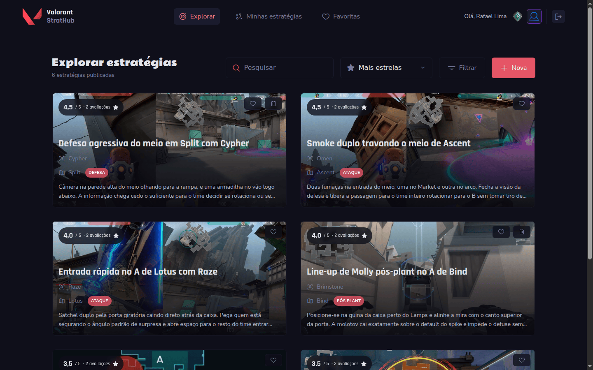
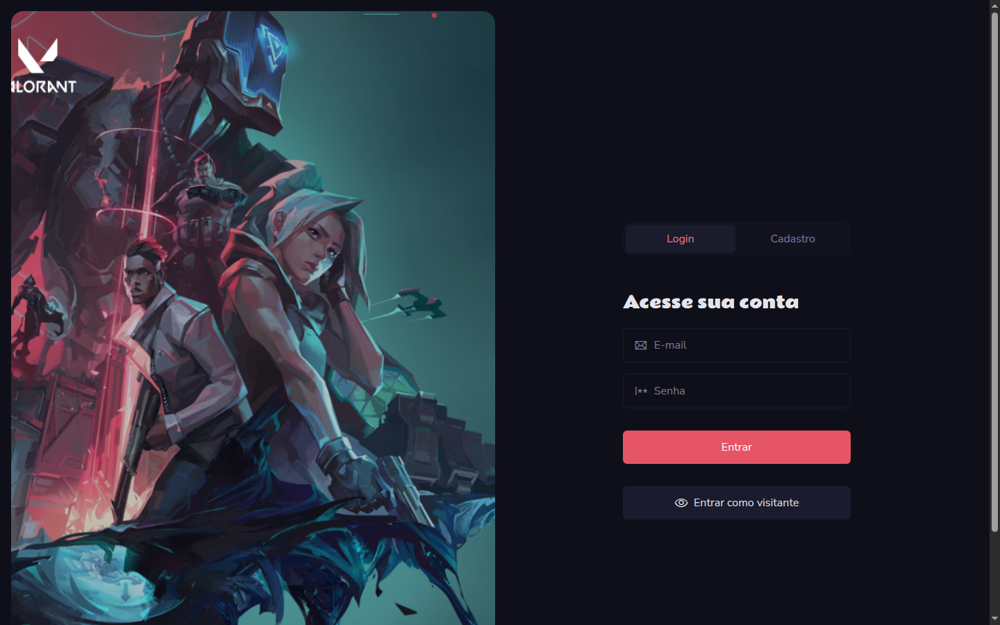
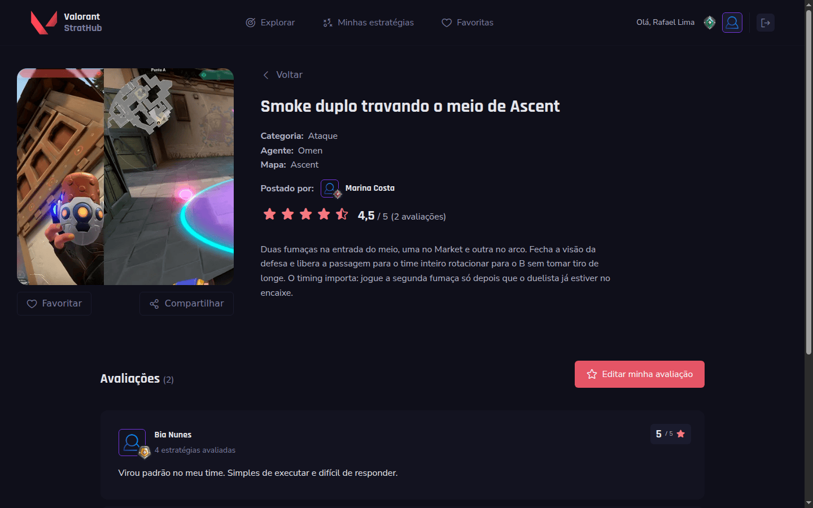
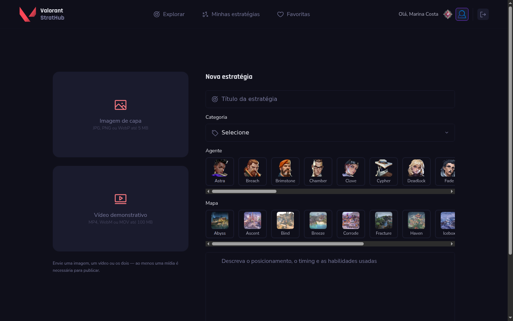
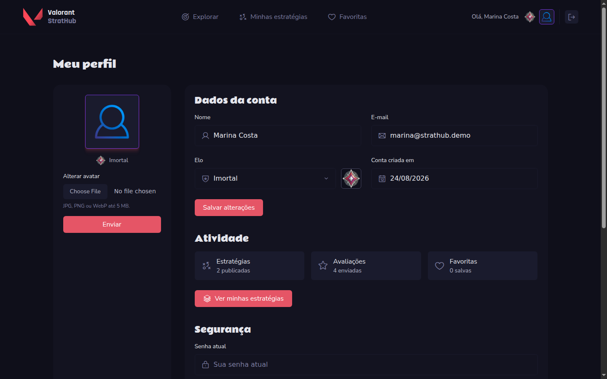
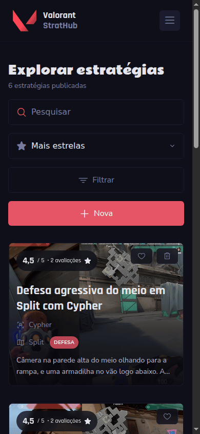
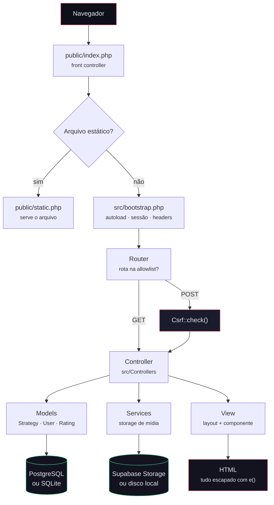

<div align="center">


# Valorant StratHub

**Plataforma colaborativa onde jogadores publicam, avaliam e encontram estratégias de Valorant por agente e mapa.**

Trabalho de conclusão de curso — PHP sem framework, do roteamento à autenticação.

[](https://github.com/mfcstt/valorant-strathub/actions/workflows/ci.yml)


</div>

<p align="center">
  
</p>

---

## Sumário

- [O que é](#o-que-é)
- [Telas](#telas)
- [Como funciona](#como-funciona)
- [Rodando em dois minutos](#rodando-em-dois-minutos)
- [Testes e qualidade](#testes-e-qualidade)
- [Decisões técnicas](#decisões-técnicas)
- [Segurança](#segurança)
- [Deploy](#deploy)
- [Estrutura](#estrutura)
- [Licença](#licença)

---

## O que é

Em Valorant, boa parte do conhecimento competitivo — line-ups de granada, timings de fumaça,
posicionamento de retake — circula em vídeos avulsos e prints em grupos de mensagem. O StratHub
organiza isso: cada estratégia tem agente, mapa, categoria, mídia e uma nota da comunidade.

**O que dá para fazer:**

| | |
|---|---|
| 🎯 **Publicar estratégias** | Título, descrição, agente, mapa, categoria e mídia (imagem, vídeo ou os dois) |
| 🔍 **Buscar e filtrar** | Por texto livre, agente, mapa e categoria, com paginação |
| ⭐ **Avaliar** | Nota de 1 a 5 e comentário; uma avaliação por pessoa, editável |
| ❤️ **Favoritar** | Lista pessoal para achar rápido depois |
| 👤 **Perfil** | Avatar, elo do jogo, atividade, troca de senha e exclusão de conta |
| 👀 **Modo visitante** | Explorar sem criar conta |

---

## Telas

<table>
<tr>
<td width="50%">

<p align="center"><em>Login e cadastro na mesma tela</em></p>
</td>
<td width="50%">

<p align="center"><em>Detalhe com nota, autor e avaliações</em></p>
</td>
</tr>
<tr>
<td width="50%">

<p align="center"><em>Seleção visual de agente e mapa</em></p>
</td>
<td width="50%">

<p align="center"><em>Perfil com elo e atividade</em></p>
</td>
</tr>
</table>

<p align="center">
  
  <br><em>Responsivo até 390px</em>
</p>

---

## Como funciona

Sem framework: o roteamento, a camada de acesso a dados, a validação, a sessão e a renderização
são código do projeto. A escolha foi didática — o objetivo do TCC era entender o que um framework
faz por baixo, não usar um.



**O caminho de uma requisição**

1. **Front controller** — todo acesso entra por `public/index.php`. Nada fora de `public/`
   é alcançável pela web.
2. **Roteador** — compara o caminho com uma lista fechada de rotas. O que não estiver nela é 404
   antes de tocar no disco.
3. **CSRF** — verificado num ponto único para toda requisição `POST`, e não controller a controller.
4. **Controller** — valida a entrada, chama os models e escolhe a view.
5. **View** — layout base, view da página e componente; toda interpolação passa por `e()`.

---

## Rodando em dois minutos

Não precisa de conta em serviço nenhum: o padrão é SQLite com armazenamento de mídia em disco.

### Com Docker

```bash
git clone https://github.com/mfcstt/valorant-strathub.git
cd valorant-strathub
cp .env.example .env
docker compose up
```

Abra <http://localhost:8080>.

### Sem Docker

Requer PHP 8.1+ com `pdo_sqlite`, `curl` e `fileinfo`, além de Composer e Node 20+.

```bash
cp .env.example .env
php -r "echo 'APP_SECRET=', bin2hex(random_bytes(32)), PHP_EOL;" >> .env
composer install
npm install && npm run build
php -S localhost:8000 -t public public/dev-router.php
```

Abra <http://localhost:8000>. O banco SQLite e o schema são criados na primeira requisição.

### Dados de demonstração

Para navegar com conteúdo em vez de telas vazias:

```bash
php database/seed-demo.php
```

Cria três usuários e seis estratégias com avaliações. Todos usam a senha `Demo#strathub1`:

| E-mail | Elo |
|---|---|
| `marina@strathub.demo` | Imortal |
| `rafael@strathub.demo` | Ascendente |
| `bia@strathub.demo` | Ouro |

---

## Testes e qualidade

```bash
composer test      # PHPUnit — 74 testes
composer analyse   # PHPStan nível 6
composer check     # os dois
```

Os testes rodam com um SQLite temporário por caso, sem depender de serviço externo. A cobertura é
deliberadamente concentrada no que dá errado de forma silenciosa:

| Área | O que é verificado |
|---|---|
| **Autenticação** | Token de sessão persistente imprevisível, revogável e com expiração conferida no servidor |
| **Ordenação** | A melhor avaliada aparece na primeira página, e não apenas no topo da página atual |
| **Injeção** | `ORDER BY` restrito a allowlist; curingas de `LIKE` escapados |
| **Redirecionamento** | Destino externo cai no fallback interno |
| **Upload** | Tipo medido por conteúdo, não pelo `Content-Type` declarado |
| **Validação** | Contagem multibyte, faixas numéricas, regra desconhecida falha alto |

A pipeline de CI roda a suíte em PHP 8.1 e 8.3, compila o CSS e sobe a imagem Docker para conferir
que a aplicação responde de fato.

---

## Decisões técnicas

<details>
<summary><strong>Por que PHP sem framework</strong></summary>

O objetivo era aprender o que um framework resolve. Escrever o roteador, a camada de sessão e o
escape de saída à mão deixa visível o custo de cada um — e por que ninguém deveria escrever de novo
em produção. Onde a decisão custava segurança, a escolha foi seguir o padrão da indústria em vez de
inventar: split-token para "continuar conectado", synchronizer token para CSRF, `password_hash` com
`PASSWORD_DEFAULT`.

</details>

<details>
<summary><strong>Por que uma única conexão por requisição</strong></summary>

A primeira versão instanciava a conexão no construtor de cada model. Uma página com dez cards abria
mais de quinze conexões TCP ao Postgres remoto, cada uma pagando a latência de rede. Hoje a conexão
é resolvida uma vez (`Database::connection()`) e o `is_favorite` de todos os cards sai numa
subconsulta `EXISTS`, em vez de uma consulta por card.

</details>

<details>
<summary><strong>Por que ordenar no banco, e não em PHP</strong></summary>

Ordenar depois de paginar ordena o recorte, não o conjunto. Com doze estratégias e dez por página, a
melhor avaliada do site podia estar na página 2 e nunca aparecer no topo de "Mais estrelas". A
ordenação vive no `ORDER BY`, com as opções restritas a uma allowlist — a cláusula é interpolada na
consulta e não aceita parâmetro vinculado.

</details>

<details>
<summary><strong>Por que dois drivers de armazenamento</strong></summary>

A mídia vai para o Supabase Storage em produção, mas exigir credenciais para rodar o projeto afasta
quem só quer olhar o código funcionando. O driver `local` grava em `public/uploads` e é escolhido
automaticamente quando não há credenciais. Ambos implementam a mesma interface, então os controllers
não sabem a diferença.

</details>

<details>
<summary><strong>Por que o Tailwind saiu do CDN</strong></summary>

`cdn.tailwindcss.com` compila as classes no navegador a cada carregamento — são centenas de KB de
JavaScript e um flash de conteúdo sem estilo. Compilado com purge, o CSS do projeto tem 24 KB. Os
ícones seguiram o mesmo caminho: servidos do próprio domínio via npm, em vez de um `<script>` de
CDN sem versão fixa.

</details>

<details>
<summary><strong>O que eu faria diferente</strong></summary>

Usaria um framework. Não por preguiça: escape de saída, CSRF e sessão segura são problemas
resolvidos, e resolvê-los à mão significa acertar em cem lugares diferentes — errar em um só já é
suficiente. Este projeto é a demonstração dessa lição, não o contrário dela.

Também começaria com testes. Vários dos defeitos corrigidos aqui — ordenação sobre a página em vez
do conjunto, flash message que nunca era consumida, foto de agente apontando para arquivo
inexistente — são exatamente o tipo de coisa que um teste pega na primeira execução e que passa
despercebida num clique manual.

</details>

---

## Segurança

O projeto passou por uma revisão de segurança depois da entrega acadêmica. O que foi corrigido está
detalhado no [CHANGELOG](CHANGELOG.md); em resumo:

- **Sessão** — token persistente no padrão split-token, com validator guardado apenas como hash,
  expiração conferida no servidor e revogação por dispositivo. `session_regenerate_id` no login e
  `use_strict_mode` contra fixação de sessão.
- **CSRF** — synchronizer token verificado num ponto único para todo `POST`.
- **XSS** — helper `e()` obrigatório em toda interpolação de view; cookie de sessão `HttpOnly`.
- **Injeção de SQL** — prepared statements em todo acesso; identificadores e cláusulas de ordenação
  restritos a allowlists.
- **Upload** — tipo medido com `finfo`, `is_uploaded_file` conferido, nome de destino gerado.
- **Vazamento de informação** — mensagens de exceção vão para o log, nunca para a tela.

### Configuração

Copie `.env.example` para `.env`. O arquivo `.env` **nunca** deve ser versionado.

| Variável | Para que serve |
|---|---|
| `APP_ENV` | `local` ou `production`. Em produção a aplicação se recusa a subir sem `APP_SECRET` forte |
| `APP_SECRET` | Segredo da aplicação. Gere com `php -r "echo bin2hex(random_bytes(32));"` |
| `APP_DEBUG` | Logs verbosos. Sempre `false` em produção |
| `USE_SQLITE` | `true` usa SQLite local; `false` usa o Postgres configurado abaixo |
| `STORAGE_DRIVER` | `local` ou `supabase`. Vazio escolhe automaticamente |
| `SUPABASE_SERVICE_KEY` | Chave administrativa: **ignora RLS**. Trate como senha de root |

> A `SUPABASE_SERVICE_KEY` dá acesso total ao banco e ao storage. Se ela vazar, rotacione no painel
> do Supabase antes de qualquer outra medida — limpar o histórico do Git não invalida a chave.

---

## Deploy

### Banco de dados

```bash
psql "$DATABASE_URL" -f database/schema.pgsql.sql
psql "$DATABASE_URL" -f database/seeds.sql
```

Para um banco que já roda a versão antiga do schema, use as migrações em `database/migrations/`
em vez do schema completo.

### Aplicação — Vercel

O `vercel.json` reescreve toda requisição para o front controller, no mesmo formato `?path=` que o
roteador espera. Variáveis de ambiente a definir no painel do projeto:

| Variável | Valor |
|---|---|
| `APP_ENV` | `production` |
| `APP_SECRET` | saída de `openssl rand -hex 32` |
| `APP_DEBUG` | `false` |
| `USE_SQLITE` | `false` |
| `STORAGE_DRIVER` | `supabase` — o disco da Vercel é efêmero e o driver local perderia os arquivos |
| `DB_HOST` `DB_PORT` `DB_NAME` `DB_USER` `DB_PASSWORD` | credenciais do pooler do Supabase |
| `SUPABASE_URL` `SUPABASE_SERVICE_KEY` | projeto e chave de serviço |

### Aplicação — Docker

A imagem serve com Apache e `DocumentRoot` em `public/` — adequada para Render, Fly.io ou qualquer
host que aceite container.

```bash
docker build -t valorant-strathub .
docker run -p 8080:80 \
  -e APP_ENV=production \
  -e APP_SECRET="$(openssl rand -hex 32)" \
  -e USE_SQLITE=false \
  -e DB_HOST=... -e DB_PASSWORD=... \
  -e SUPABASE_URL=... -e SUPABASE_SERVICE_KEY=... \
  valorant-strathub
```

Em plataforma serverless, use `STORAGE_DRIVER=supabase`: o disco é efêmero e o driver local perderia
os arquivos entre invocações.

---

## Estrutura

```
├── database/            schema, seeds e migrações SQL
├── docker/              php.ini e configuração do Apache
├── docs/screenshots/    imagens do README
├── public/              raiz web: front controller, CSS, JS, assets
├── resources/css/       entrada da compilação do Tailwind
├── src/
│   ├── Controllers/     um arquivo por rota
│   ├── Http/            lógica de requisição compartilhada
│   ├── Models/          Strategy, User, Rating, Favorite, MediaFile
│   ├── Services/        armazenamento de mídia e validação de upload
│   ├── Support/         Router, Auth, Csrf, Database, Validation, View
│   ├── Views/           layout, views, componentes e partials
│   └── bootstrap.php    inicialização da aplicação
└── tests/               PHPUnit (Unit e Feature)
```

---

## Licença

[MIT](LICENSE).

---

<div align="center">
<sub>

Projeto acadêmico sem vínculo com a Riot Games. Valorant e todos os ativos relacionados
— nomes de agentes, mapas, arte e tipografia — são propriedade da Riot Games, Inc.
Este projeto não é endossado pela Riot Games e não reflete suas opiniões.

</sub>
</div>
